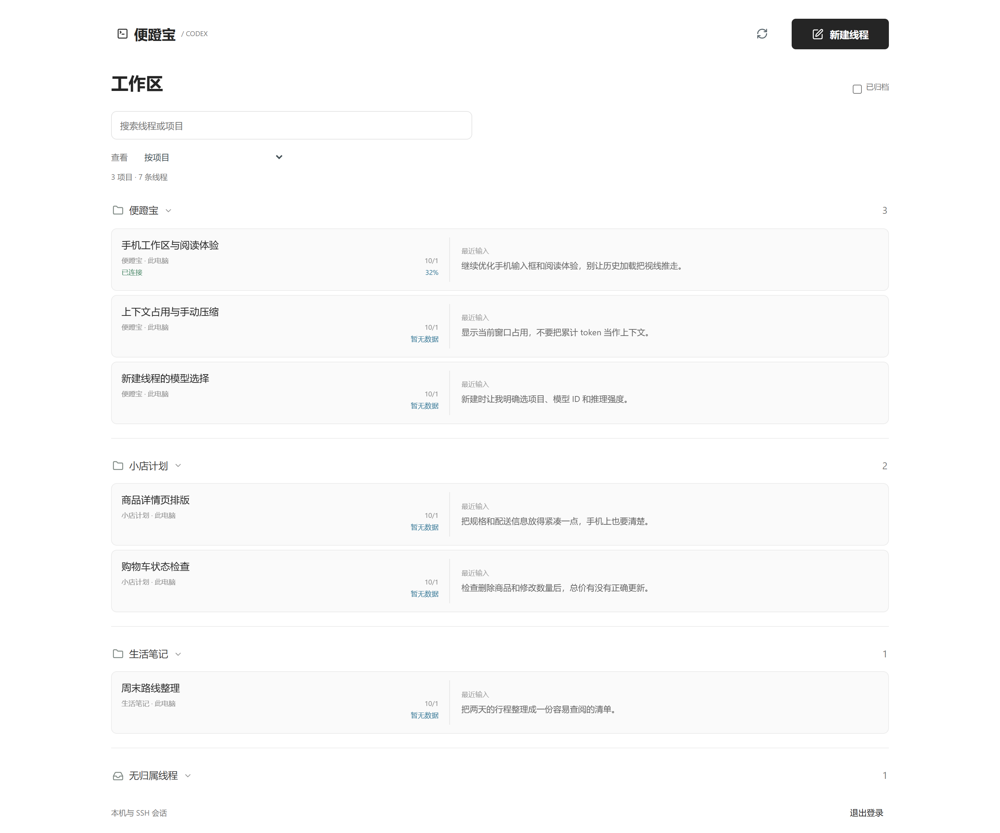
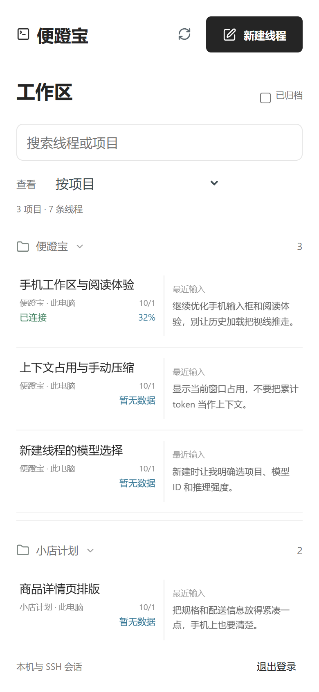
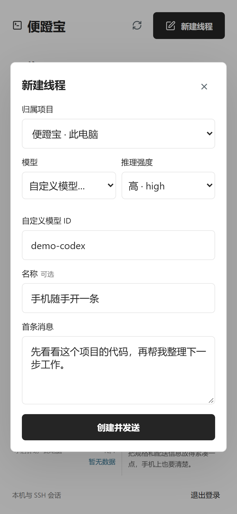
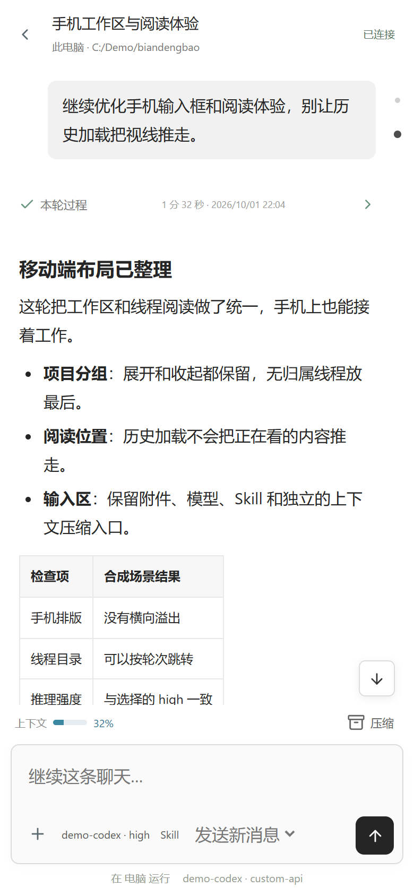

# 便蹬宝

**随时掏出手机，蹬一下电脑上的 Codex。**

[](LICENSE)
[](https://github.com/Yuimi-chaya/biandengbao/actions/workflows/tests.yml)
[](https://www.python.org/)

## 使用场景

电脑上的任务还没跑完，人已经躺到床上了。手机打开浏览器，看看进度、补一句需求、处理确认，接着蹬。

- **家里用**：手机和电脑连同一个局域网，不用坐回椅子前。
- **出门用**：给运行 Codex App 的电脑配置 HTTPS 隧道或反向代理，手机联网就能接着用。不是把任务迁移到云端。
- **纯 API 用户也能用**：沿用 Codex App 已配置的 API/provider，不依赖 ChatGPT 手机 App，也不要求手机登录 OpenAI 账号。

前提就几个：电脑开机且不休眠、Codex App 已打开、服务在运行，Codex 的账号或 API 有可用额度。**手机默认登录的是便蹬宝独立网关，不是 OpenAI 账号。**

## 支持功能



| 位置 | 能做什么 |
| --- | --- |
| 新建线程 | 显式选择已有项目或无归属、模型 ID、推理强度，填写首条消息后创建并发送 |
| 工作区 | 按最近交互或项目归属排列；项目展开/收起，无归属放最后；保留搜索和归档筛选 |
| 线程辨识 | 查看最后一条用户输入预览、上下文窗口占用；未取得实时状态时明确标注历史值或未知 |
| 同步与输入 | 读取原 App 的同一条聊天，实时跟进回复；发送、补充当前任务、排队及撤回队列 |
| 阅读体验 | Markdown、代码高亮、思考摘要、工具输出；已完成轮次折叠过程、保留最终回复，显示耗时和完成时间 |
| 线程操作 | 轮次目录快速跳转、手动压缩上下文、停止前二次确认；处理支持的审批与提问卡片 |
| 模型与附件 | 切换模型/推理强度，选择已安装 Skill；本地线程上传图片和文件，每个 ≤10 MB、每条消息 ≤8 个 |
| 手机显示 | 平滑流式文字、阅读位置保持、适配手机键盘的输入区；息屏返回或网络恢复后自动补同步，近期线程快速切回 |

本地未加载线程在手机点开后按需连接，不需要先在电脑把几百条聊天逐个点一遍。自动连接可能切换电脑当前页面；已归档线程需先恢复。

返回浏览器时保留草稿并读取最新状态；网关登录过期会提示重新登录，不需要重启浏览器。电脑 App 重启、连接过期或近期缓存被替换后，仍可能需要重新连接线程。

长线程先显示最近 12 轮，向上滚动自动加载更早记录，也可点击“加载更早记录”。已完成过程和大段工具、思考详情在展开时读取；手机息屏期间新增多轮时，会补齐已读页与最新页之间的记录，不会只留下最新一截。

上下文占用来自 App 的可用状态，不是累计账单 token，也不保证逐 token 更新。模型和强度取决于当前 provider；手填模型 ID 不会让不可用的模型变可用。

**手机工作区**



**新建线程**



**线程内**



### 看一眼怎么用

以下均为**虚拟项目、合成聊天和模拟执行结果**：展示真实网页交互，不使用私人聊天，不代表真实模型执行验收。视频为 780 × 1740、25 fps 的连续录制，无配音；点击链接打开或下载完整 MP4。

- [工作区与搜索 · 20 秒](https://github.com/Yuimi-chaya/biandengbao/releases/download/v0.1.0/workspace.mp4)：项目展开/收起、搜索、切换最近交互与项目分组。
- [新建线程 · 26 秒](https://github.com/Yuimi-chaya/biandengbao/releases/download/v0.1.0/create.mp4)：选择项目、自定义模型 ID、推理强度，填写需求并模拟创建。
- [线程阅读与上下文 · 19 秒](https://github.com/Yuimi-chaya/biandengbao/releases/download/v0.1.0/thread.mp4)：展开思考摘要与工具输出、轮次跳转、模拟压缩上下文。

## 安装使用

需要 **Windows 10/11 或 macOS、Python 3.9+、正在运行的 Codex App**。网关只用 Python 标准库，前端资源随仓库提供，不用 `pip install` 或 `npm install`。

### 交给 Agent

把下面这段话发给**电脑上的 Codex App**：

```text
请帮我部署并运行 https://github.com/Yuimi-chaya/biandengbao ：先识别 Windows 或 macOS，阅读 README；保留我现有 Codex App 聊天、模型认证、provider 和权限设置，默认启用账号密码与局域网访问。请从当前 App 环境启动，让服务继承桌面工具通道和当前线程上下文，以支持新建线程及按需连接旧线程；若我明确需要外网，再配置临时 HTTPS 隧道或已有反向代理。登录自启动默认关闭，只有我明确要求时才通过 configure.py 启用 Windows 登录任务。检查登录保护、聊天读取、实时同步和创建入口；真实发送、附件、停止、压缩等操作只在我授权的专用测试线程验证。不要关闭或重启 Codex App，不要强杀进程；需要停网关时使用 stop.py。保持服务运行，最后给我可点击的手机地址、登录凭据获取方式、启停命令、已验证结果和仍需我完成的步骤。
```

新建线程及旧线程按需激活依赖 App 的桌面工具通道。建议让 App 内的 Agent 部署；普通终端若缺少调用上下文、发现多个通道或 App 已重启，这两项可能不可用，需从当前 App 环境重新启动网关，不能随便选一个通道。

### 自己启动：局域网

Windows / PowerShell：

```powershell
git clone https://github.com/Yuimi-chaya/biandengbao.git
cd biandengbao
py -3 -B .\run.py --lan
```

macOS：

```sh
git clone https://github.com/Yuimi-chaya/biandengbao.git
cd biandengbao
python3 -B "$PWD/run.py" --lan
```

手机连同一局域网，打开终端显示的电脑 IP 地址。账号默认 `admin`，随机密码在 `.local/首次登录.txt`。保持启动终端运行；Windows 防火墙只按需允许专用网络。如果没有 `py`，改用 `python`。

停止用另一个终端运行 `py -3 -B .\stop.py`（macOS：`python3 -B stop.py`）；再次启动用上面的命令。自定义 `--config` 时启停都要传同一路径。改密码前先停止，再运行 `run.py --set-password`。重启服务后需要重新登录。

### 可选：登录自启动

Windows 默认不开启。先建立网关密码配置，再让 App 内的 Agent 执行 `py -3 -B .\configure.py --autostart enable`；也可双击 `configure.cmd` 选择。以后登录 Windows，后台持续监测 App，同一次开机内每次打开都能启动或重新绑定局域网服务；不自动打开 App，不开启外网或免密。手动停止网关后保持停止，直到下次打开 App。

查看状态用 `--autostart status`，关闭用 `--autostart disable`，移除任务用 `--autostart remove`。关闭自启动不停止当前服务。自定义端口/配置和限制见 [自启动配置](docs/AUTOSTART.md)；macOS 暂不支持此选项。

### 外网访问

先安装 [Cloudflare 官方 cloudflared](https://developers.cloudflare.com/cloudflare-one/networks/connectors/cloudflare-tunnel/downloads/)，停止原网关，再启动：

```powershell
# Windows，替换为自己的 cloudflared 路径
py -3 -B .\run.py --lan --tunnel --cloudflared 'C:\tools\cloudflared.exe'
```

```sh
# macOS，cloudflared 已在 PATH 中
python3 -B "$PWD/run.py" --lan --tunnel --cloudflared "$(command -v cloudflared)"
```

打开打印出的 HTTPS 地址，用同一套网关密码登录。临时地址重启会变，流量经过 Cloudflare；临时隧道使用长轮询，局域网使用 SSE。隧道不是永久免费在线服务，也不会替你保持电脑唤醒。

已有 HTTPS 反向代理时，指向 `127.0.0.1:8787`，启动追加 `--origin https://你的域名`；保留 Host、关闭 SSE 缓冲。不建议直接把 HTTP 端口暴露到公网，公网不要免密。

## 声明

- 社区项目，与 OpenAI 无隶属关系；基于 [try2love/codex-mobile-bridge](https://github.com/try2love/codex-mobile-bridge) 二次开发，保留原作者版权及 [MIT 许可](LICENSE)。前端依赖许可见 [vendor](web/vendor/README.md)。
- 复用 App 原会话与认证，不把模型 API key 放到手机，不写原聊天数据库，不分发或修改 Codex App。任务仍在原电脑/已连接 SSH 主机执行。
- 网关有读聊天、发消息和回应审批的能力，相当于电脑控制入口。只分享给可信的人；保护 `.local/`，不要上传密码、发送记录、附件或私人配置。局域网 HTTP 不加密，跨不可信网络请用 HTTPS。
- 依赖内部 IPC，App 更新可能需要适配。当前增强版主要在 Windows 验证；macOS 基础能力沿用上游，新增功能未完成 macOS 实机验收。SSH 基础链路保留，但远端附件上传/下载不支持；不支持独立云聊天和 Linux 桌面。复杂请求仍可能需要回到电脑处理。
- 页面演示和自动测试不等于所有真实操作都已验证。真实新建、发送、附件读取、停止和压缩，以及不同手机硬件的键盘/缩放体验，仍需在自己的环境验收。具体范围见 [验证记录](VERIFICATION.md)，原理见 [实现说明](ARCHITECTURE.md)。

反馈问题请附系统、Codex App/运行时版本和脱敏错误，不要贴完整聊天或密钥。开发测试：`python -B -m unittest discover -s tests`；前端断言：`node tests/thread-ui.test.cjs`、`node tests/settings.test.cjs`。
